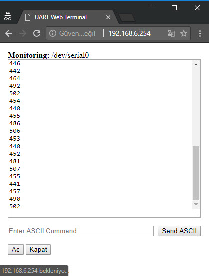

# UART Web Terminal

Monitors local UART (serial) ports to a web page and interact with it by ASCII commands.




## Installing

1) For example on raspberry pi excute commands below to install apache and php.
    ```
    pi@raspberry:~ $ sudo apt-get update
    pi@raspberry:~ $ sudo apt-get upgrade -y
    pi@raspberry:~ $ sudo apt-get install apache2
    pi@raspberry:~ $ sudo apt-get install php libapache2-mod-php -y
    ```
2) And give permission to www-data account to access serial devices (serial0, stty0 or ttyUSBx)
    ```
    pi@raspberry:~ $ sudo usermod -a -G dialout www-data
    ```
3) Copy all files to web publishing directory of server (ex: /var/www/html)
4) Set basic authentication info (username/password) and SERIAL_DEVICE in config.php.
5) Thats all.

## Using

Simply browse the index.php via any browser or mobile. Send ASCII commands via input box. Additionaly you can add fixed command buttons for highly used commands. To do this simply copy/paste input tags in form in command.php.

```
http://192.168.0.10/index.php
```

## Authors

* **Ozgur Koca** - *Initial work* - [Tankado.com](https://tankado.com/)

See also the youtube channel (Turkis) of [Author](https://www.youtube.com/user/zerostoheroes/featured)

## License

This project is licensed under the MIT License.

